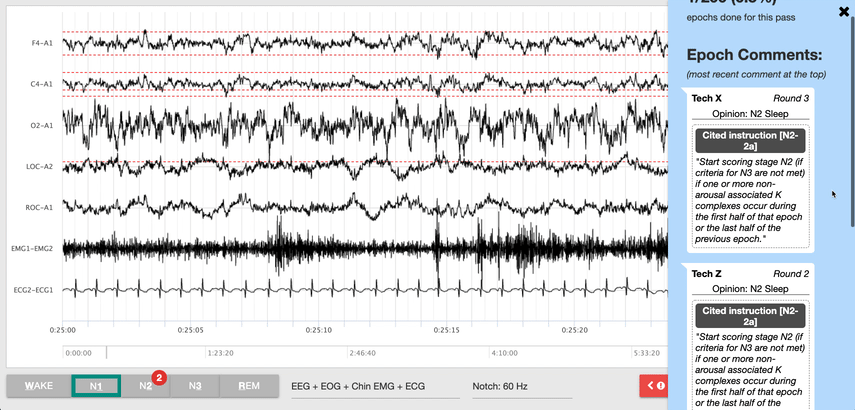

# CrowdEEG Platform

## A Collaborative Annotation Tool for Medical Time Series Data

This repository contains the code for the **[CrowdEEG](http://crowdeeg.ca/)** web application, a collaborative annotation tool for medical time series data. Check out our **[Getting Started](docs/getting_started_meteor_cloud.md)** guide to learn how to run and deploy this web app.



This tool has been referenced in the following papers:

* Mike Schaekermann, Graeme Beaton, Elaheh Sanoubari, Andrew Lim, Kate Larson, and Edith Law: **[Ambiguity-aware AI Assistants for Medical Data Analysis](https://dl.acm.org/doi/abs/10.1145/3313831.3376506)**. [CHI 2020](http://chi2020.acm.org/).
* Mike Schaekermann, Graeme Beaton, Minahz Habib, Andrew Lim, Kate Larson, and Edith Law: **[Understanding Expert Disagreement in Medical Data Analysis through Structured Adjudication](https://dl.acm.org/doi/10.1145/3359178)**. [CSCW 2019](http://chi2020.acm.org/).
* Sokolov, E. and Abdoul Bachir, D. H. and Sakadi, F. and Williams, J. and Vogel, A. C. and Schaekermann, Mike and Tassiou, N. and Bah, A. K. and Khatri, V. and Hotan, G. C. and Ayub, N. and Leung, E. and Fantaneanu, T. A. and Patel, A. and Vyas, M. and Milligan, T. and Villamar, M. F. and Hoch, D. and Purves, S. and Esmaeili, B. and Stanley, M. and Lehn‐Schioler, T. and Tellez‐Zenteno, J. and Gonzalez‐Giraldo, E. and Tolokh, I. and Heidarian, L. and Worden, L. and Jadeja, N. and Fridinger, S. and Lee, L. and Law, E. and Fodé Abass, C. and Mateen, F. J.: **[Tablet‐based electroencephalography diagnostics for patients with epilepsy in the West African Republic of Guinea](https://onlinelibrary.wiley.com/doi/abs/10.1111/ene.14291)**. [European Journal of Neurology 2020](https://onlinelibrary.wiley.com/journal/14681331).
* Williams, Jennifer A and Cisse, Fodé Abass and Schaekermann, Mike and Sakadi, Foksouna and Tassiou, Nana Rahamatou and Hotan, Gladia C. and Bah, Aissatou Kenda and Hamani, Abdoul Bachir Djibo and Lim, Andrew and Leung, Edward C.W. and Fantaneanu, Tadeu A. and Milligan, Tracey A. and Khatri, Vidita and Hoch, Daniel B. and Vyas, Manav V. and Lam, Alice D. and Cohen, Joseph M. and Vogel, Andre C. and Law, Edith and Mateen, Farrah J: **[Smartphone EEG and remote online interpretation for children with epilepsy in the Republic of Guinea: Quality, characteristics, and practice implications](https://linkinghub.elsevier.com/retrieve/pii/S1059131119302067)**. [Seizure 2020](https://www.journals.elsevier.com/seizure-european-journal-of-epilepsy).

You may also be interested in the **[CrowdEEG Dataset](https://github.com/crowdeeg/dataset)**.

If you find this web application useful in your research, please consider citing:

```
@inproceedings{Schaekermann2020AmbiguityAwareAI,
  Author = {Schaekermann, Mike and Beaton, Graeme and Sanoubari, Elaheh and Lim, Andrew and Larson, Kate and Law, Edith},
  Title = {Ambiguity-Aware AI Assistants for Medical Data Analysis},
  Year = {2020},
  ISBN = {9781450367080},
  Publisher = {Association for Computing Machinery},
  Address = {New York, NY, USA},
  DOI = {10.1145/3313831.3376506},
  Pages = {1–14},
  Numpages = {14},
  Location = {Honolulu, HI, USA},
  Series = {CHI '20}
}
```
